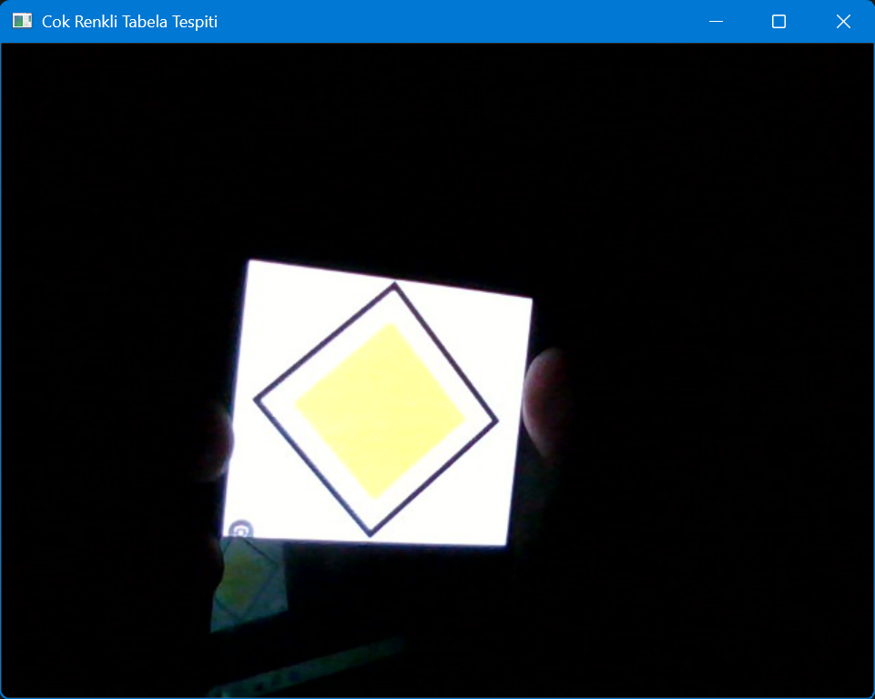
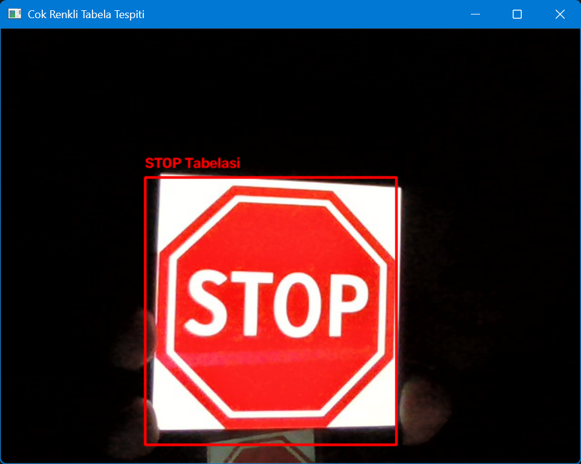
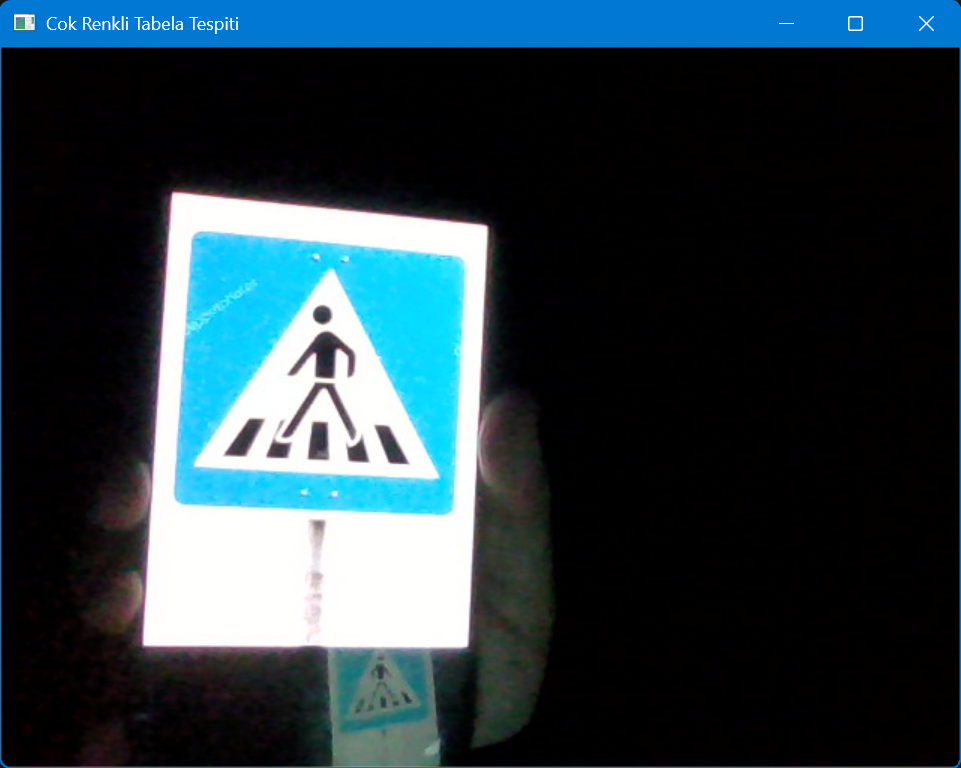

# Real-Time Traffic Sign Detection (OpenCV)

A real-time computer vision application that detects traffic-sign-like objects from a webcam stream using **color segmentation** and **shape analysis** with OpenCV and Python.





## How it works

1. Each webcam frame is converted from BGR to the **HSV color space**, which is far more robust to lighting changes than RGB.
2. Color masks are created for **red, blue and yellow**, the main traffic sign colors. Morphological closing fills hollow shapes such as red-bordered warning triangles.
3. Contours are extracted from each mask, and small noise blobs are discarded by a minimum-area check.
4. A **fill-ratio check** (contour area / bounding-box area) rejects irregular shapes such as skin or hands.
5. `approxPolyDP` estimates each contour's number of corners, and a simple rule-based classifier labels it:

| Color  | Shape          | Label                 |
|--------|----------------|-----------------------|
| Red    | Octagon (7-9)  | STOP sign             |
| Red    | Triangle       | Prohibition / warning |
| Blue   | Circle-like    | Mandatory direction   |
| Yellow | Triangle / quad| Caution / warning     |

## Project structure

- `kamera_tespit.py`: live webcam detection (main application)
- `gorsel_test.py`: step-by-step processing of a single image (grayscale, blur, Canny edges)
- `test_kamera.py`: minimal camera test that saves one frame to disk

## Setup

```bash
python -m venv venv
venv\Scripts\activate        # Windows
pip install -r requirements.txt
```

## Usage

```bash
python kamera_tespit.py
```

Point the webcam at a traffic sign (a printed sign or one shown on a phone screen). Press `q` to quit.

`gorsel_test.py` expects an image named `test_isare.jpg` in the project folder. Use any sign image of your own.

## Limitations

This is a rule-based detector, not a trained classifier:

- It can produce false positives on objects with similar colors.
- Detection depends on lighting conditions and camera quality.
- It recognizes signs by color and geometry only and cannot tell apart different signs of the same shape and color.

## Next steps

- Replace the rule-based classifier with a trained model (CNN / YOLO) using a dataset such as GTSRB
- Add temporal smoothing across frames to reduce flickering
- Add OCR or template matching to distinguish signs of the same shape

## Tech stack

Python, OpenCV, NumPy

## Author

Ayşe Şilan Karabulut, Computer Engineering student, KTO Karatay University